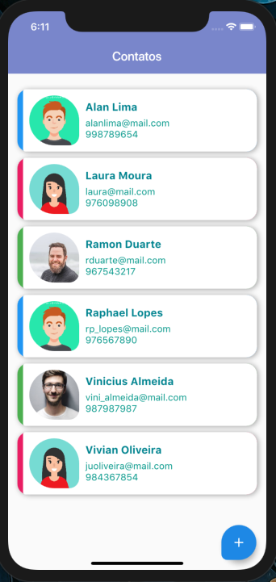
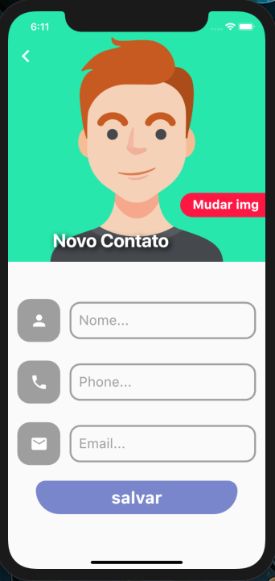
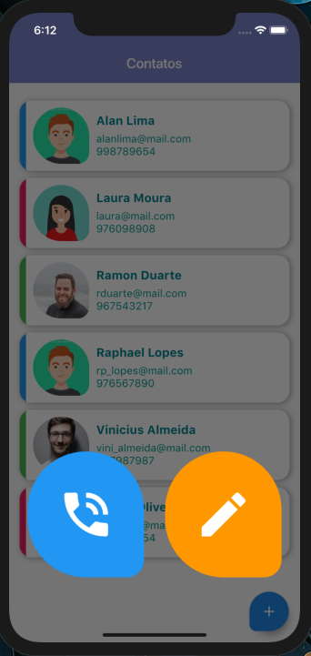
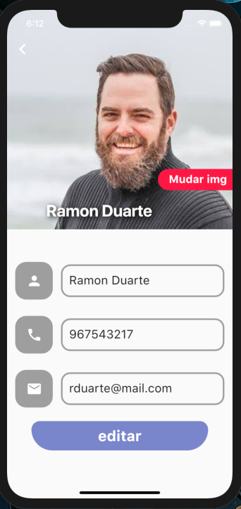
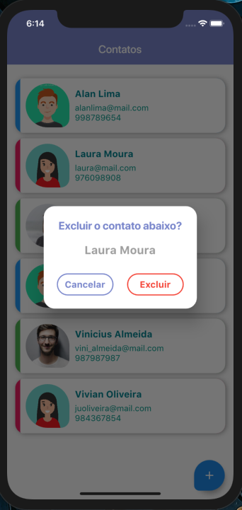

# agenda_contatos_flutter
  
 
 App Agenda de Contatos Funcional.

   
 

  
 
 
 
   
 
 

 
 

   
 
 
# O App aborda:

    • Persistência de dados com SQFlite.
    
    • Escolha de imagem na galeria com ImagePicker.
    
    • Realização de chamadas telefônicas.
    
    • Ordenação de itens.
      
    • ListView.
    
    • SliverAppBar.
      
    • BottomSheet.
    
    • Custom FloatingActionButton.
